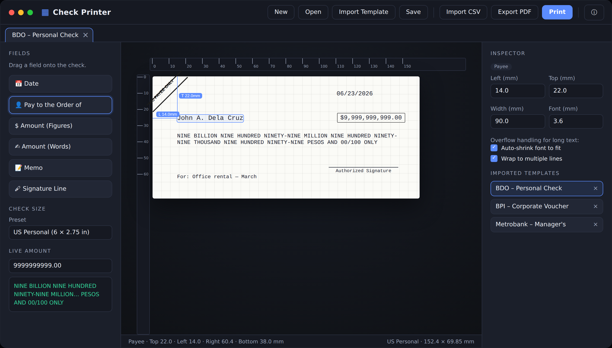

# Check Printer

**Design and print custom bank checks — on macOS and Windows.**
Developed by **Pcdx** (Plan · Code · Deploy · Execute).

---

## What it is

Check Printer lets you reproduce the exact layout of any pre-printed check and overprint the
variable details — payee, date, and amount — precisely where they belong. You build a reusable
**template** that mirrors your check at true physical size, position each field down to the
millimeter, then print onto the real stock or export a print-ready PDF.



### Key features

- **True-to-size canvas** — the on-screen check matches real millimeters, so what you place is what prints.
- **Drag-and-drop fields** — date, payee, amount (figures), amount (words), memo, signature, MICR, and custom text.
- **Live distance guides** — while dragging, see the distance from all four edges in millimeters.
- **Automatic amount in words** — type the figure once; the written words update automatically (English), with configurable cents style, currency word, and uppercase.
- **Auto-fit** — long payee names and large amounts shrink and wrap so they always fit.
- **US & European number formats** — `1,234.50` or `1.234,50`.
- **Custom date formats & digit spacing** — line digits up with pre-printed date boxes, e.g. `0 2 - 3 1 - 2 0 2 6`.
- **A/C Payee Only crossing** — the classic diagonal corner crossing, with editable text.
- **Templates** — save reusable layouts (`.chktpl`), build a persistent template library, and lock templates for fill-only use.
- **Batch printing from CSV** — print a whole run of checks from a spreadsheet; export one multi-page PDF.
- **Runs entirely on your computer** — no account, no cloud; your data stays local.

---

## Why you may see a security warning

Check Printer is distributed directly (from a website or file), not through the Mac App Store or
Microsoft Store. Both operating systems show a caution prompt the **first time** you open an app
that wasn't downloaded from their store or signed with a paid developer certificate. This is normal
for independent software. The steps below show how to open it anyway.

> The app is safe to run; these warnings are about *where the app came from*, not about anything
> wrong with the app itself. Only follow these steps for software you trust and downloaded from a
> source you trust.

---

## macOS — how to open

On recent macOS versions, double-clicking may show:
*"Check Printer can't be opened because Apple cannot check it for malicious software,"* or
*"Check Printer is damaged and can't be opened."*

### Method 1 — Open from System Settings (recommended)

1. Move **Check Printer** to your **Applications** folder.
2. Double-click it once. When the warning appears, click **Done** (or Cancel).
3. Open **System Settings → Privacy & Security**.
4. Scroll down to the **Security** section. You'll see a line like
   *"Check Printer was blocked to protect your Mac."*
5. Click **Open Anyway**.
6. Confirm with **Open**, and authenticate with your password or Touch ID if prompted.

The app opens normally from then on — you only do this once.

### Method 2 — Right-click to open (older macOS)

1. In **Finder**, locate Check Printer (in Applications).
2. **Control-click** (or right-click) the app icon and choose **Open**.
3. In the dialog, click **Open** again.

> On macOS 15 (Sequoia) and newer, the right-click shortcut may not appear for un-notarized
> apps — use **Method 1** instead.

### Method 3 — Remove the quarantine flag (Terminal)

If the app still won't open, clear the download-quarantine attribute:

```bash
xattr -dr com.apple.quarantine "/Applications/Check Printer.app"
```

Then open the app normally. (Adjust the path if you keep the app elsewhere.)

---

## Windows — how to open

On Windows you'll typically see a blue **"Windows protected your PC"** dialog from
**Microsoft Defender SmartScreen** when running an unsigned installer.

### Open the installer

1. Double-click the installer (e.g. **`Check Printer Setup 1.0.0.exe`**).
2. When the SmartScreen dialog appears, click **More info**.
3. A **Run anyway** button appears — click it.
4. The installer proceeds normally; follow the prompts (choose the install folder, create shortcuts, etc.).

> If you don't see **More info**, the dialog may be the very compact version — click the small
> text/link in the window first, then **Run anyway** appears.

### If your browser blocked the download

Some browsers flag less-common downloads. In your browser's downloads list, find the file and
choose **Keep** / **Keep anyway** to finish downloading, then run it using the steps above.

### Optional: unblock the file manually

1. Right-click the downloaded `.exe` and choose **Properties**.
2. On the **General** tab, if you see an **Unblock** checkbox near the bottom, tick it.
3. Click **Apply → OK**, then run the installer.

---

## After installation

- **macOS:** launch from **Applications** or Launchpad.
- **Windows:** launch from the **Start menu** or the desktop shortcut.

See the full **User Guide** (PDF) for how to build templates, position fields, generate amounts in
words, and batch-print from CSV.

---

## Frequently asked questions

**Is the warning a sign the app is unsafe?**
No. It appears for any app distributed outside the official stores or without a paid signing
certificate. It's about the app's *origin*, not its behavior. Only run software you trust.

**Will it send my data anywhere?**
No. Check Printer runs entirely on your computer. Templates and CSV files stay on your machine.

**Do I have to do this every time?**
No. After you allow it once, the app opens normally afterward.

**Can the developer remove the warning?**
Yes — by code-signing and notarizing the app (an Apple Developer membership on macOS, or a paid
EV code-signing certificate on Windows). Until then, the one-time "open anyway" step above is how
users launch it.

---

*Check Printer — developed by **Pcdx** · Plan · Code · Deploy · Execute*
